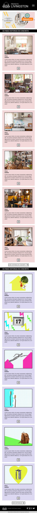
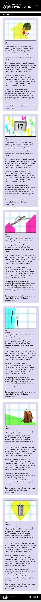
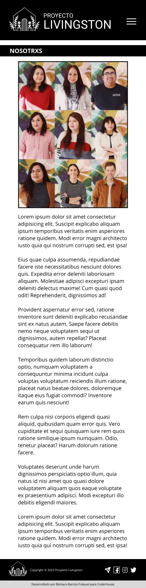
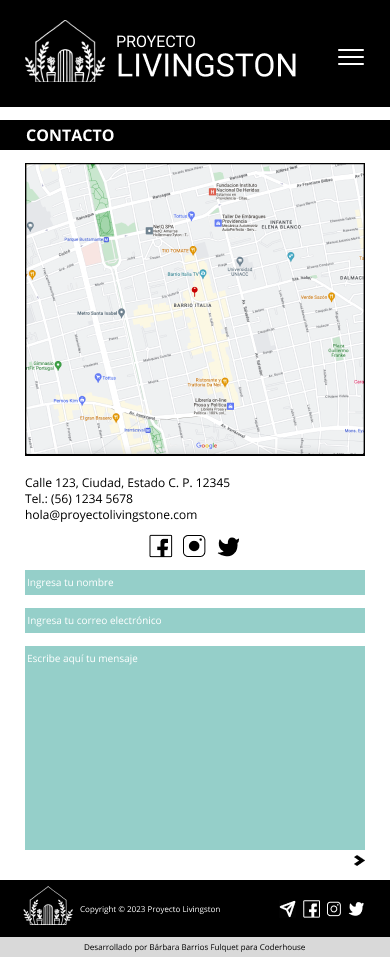
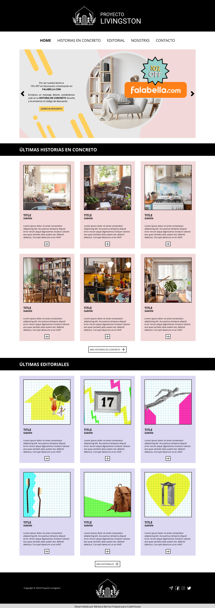
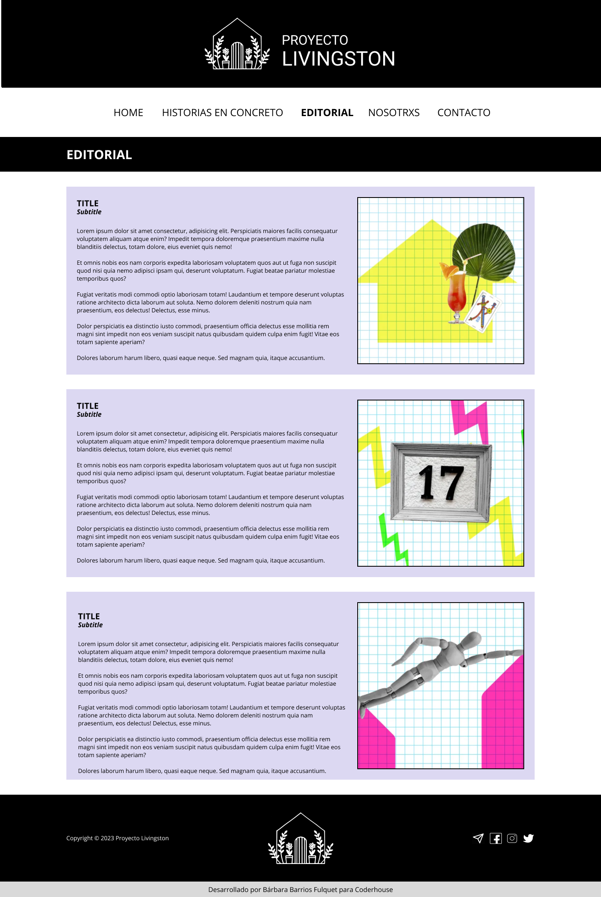
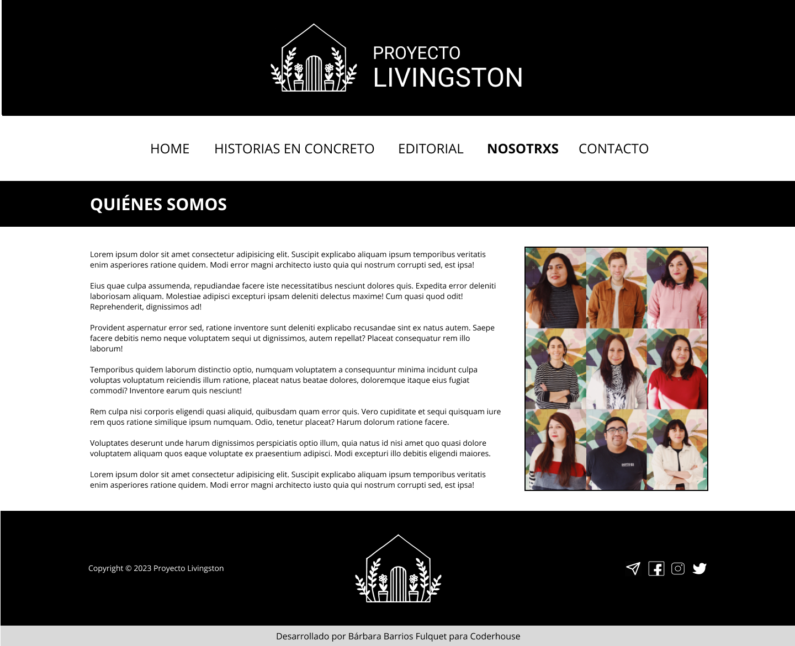
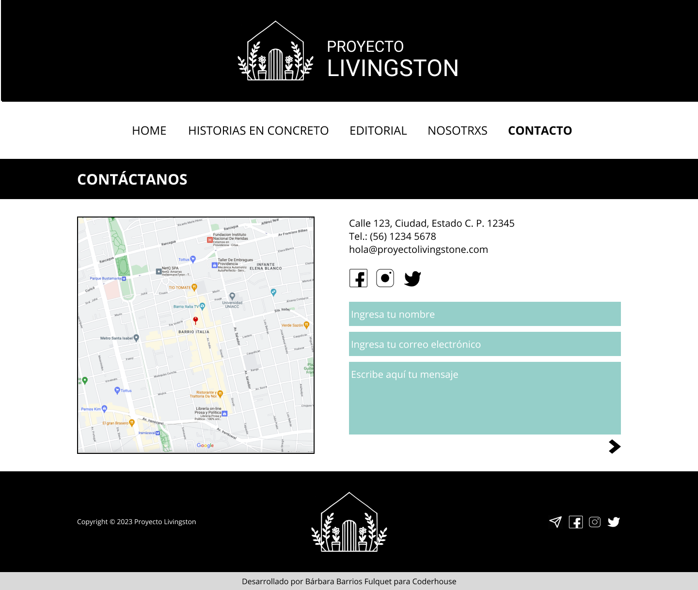

# 
PROYECTO LIVINGSTON

## ÍNDICE

[1. Resúmen del proyecto](#1-resúmen-del-proyecto) 
[2. Prototipados](#2-prototipados) 
[3. Links](#3-links)

---

## 1. RESÚMEN DEL PROYECTO

Proyecto Livigston es una web dedicada a la arquitectura y el diseño de interiores. Fue desarrollada como proyecto integrador del curso de Desarrollo Web de Coderhouse 2023

---

## 2. PROTOTIPADOS

 
 
 
 
 

 
 
 
 

---

## 3. LINKS

https://github.com/barbarabarriosfulquet/Proyecto_Livingston 
https://barbarabarriosfulquet.github.io/Proyecto_Livingston/ 
http://proyectolivingston.lovestoblog.com/?i=1
